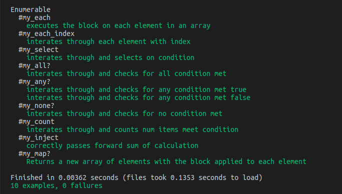

# Testing-Your-Ruby-Code---Enumerable
## Getting Started 

First of all, make sure you have ruby installed on your computer.
Install rspec gem wih the following command line: 
====> gem install rspec

# How to run the tests

After cloning the project, enter the Testing-Your-Ruby-Code---Enumerable folder and open a terminal inside the folder or by entering the following command:
====> cd Testing-Your-Ruby-Code---Enumerable
And then typing the following command
====> rspec spec/enumerable_spec.rb

# Results
You should get something like this:
 

# Contributors 

* [Ibrahim Dauda](https://github.com/ibrolive) 
* [Armand Dongmo](https://github.com/Dongmo12)